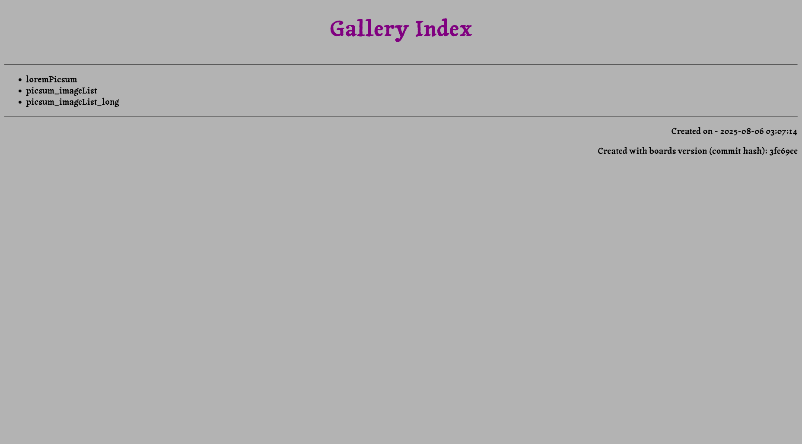
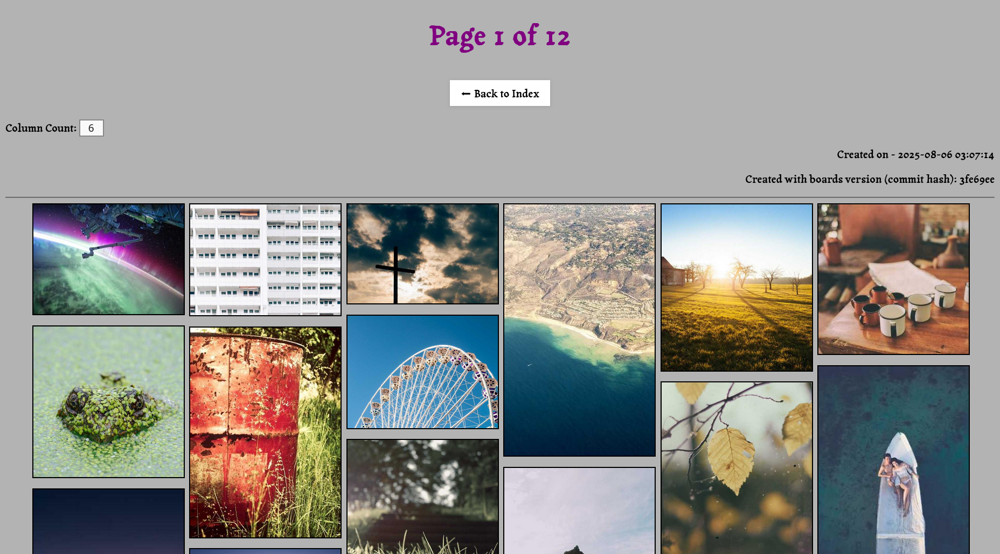

# pixBoards

not changing the repo name due to dependency issues. this repo will be archived soon.

Gui has not been set up yet. Don't try to run the gui.py

first, rename the config_example.yml to config.yml. or start afresh, your choice.

if you wish to upload to imgchest and use those links instead, use `--upload`

If it is the first time you are uploading, you will have to install postgresql first if not already installed. 

### install

you can install the pixBoards package from PyPi

`pip install pixBoards`

or clone the repo.

`git clone https://github.com/flynnsharwood/boards_v2.git`

### First time upload
If it is the first time you are uploading, you will have to install postgresql first if not already installed. 

Also, if you have a LOT of files to upload for the first time, go to the uploader folder. [repo link](https://github.com/flynnsharwood/imgUploader)

1. set up the directories list in config.yml
1. run listFiles.py. it will create a file named "MediaFiles.py"
2. now run calc_hex.py
3. run fileListUpload.py

fileListUpload basically uploads in batches of 20, unlike the original script where it uploads each image individually. This will upload and cache the links and hashes to postgress db

### Usage
simply use the binary file provided `boards.exe` 

Or do `python3 cli.py` or `python3 __main__.py`

flags you might use

`--upload` ensure all files are being uploaded. If you have pictures with the same filenames in different folders, you might need to fix this.

`--gitPush` this will push your created html files to a github repo. set up your repo to trigger a gh_pages deployment every push.

`--config` change the config file being used

here is a link to an example board - [https://flynnsharwood.github.io/exampleBoard/index.html](https://flynnsharwood.github.io/exampleBoard/index.html) 

---
## features

added an button to load a random page in 0.2.18

---

## screenshots

example of index file

example of image board

